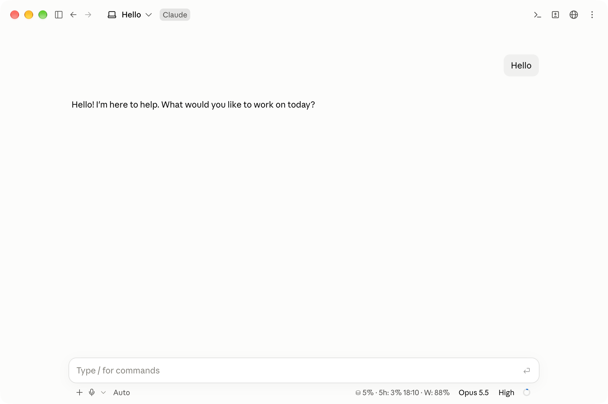

# claude-mods

Claude Code Mod 合集，以插件市场 `wobok-mods` 的形式发布。

要求：Claude Code v2.1.287 或更高版本。

## 添加市场

首次使用前执行一次：

```bash
claude plugin marketplace add WoBok/claude-mods
```

## Mod 列表

| Mod | 说明 | 安装 |
| --- | --- | --- |
| [usage-band](#usage-band) | 在底栏显示上下文与用量限额 | `claude plugin install usage-band@wobok-mods` |

安装后新开会话即可生效。

## usage-band

在输入框下方的底栏中显示：

```
⛁ 25% · 5h: 17% 13:00 · W: 86%
```



| 字段 | 含义 |
| --- | --- |
| `⛁` | 上下文已用比例 |
| `5h` | 5 小时限额已用比例及重置时间 |
| `W` | 每周限额已用比例 |

限额数据仅在使用 Pro / Max 订阅登录时可用。

## 更新与卸载

```bash
claude plugin marketplace update wobok-mods        # 获取最新版本
claude plugin update <mod>@wobok-mods              # 更新
claude plugin uninstall <mod>@wobok-mods           # 卸载
```
